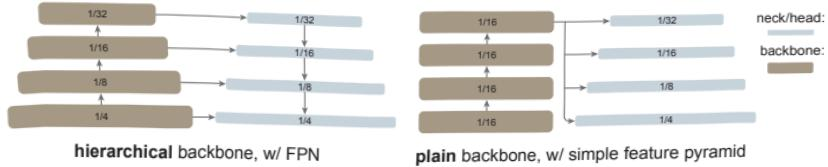
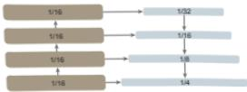
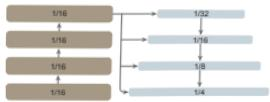
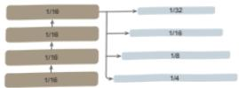
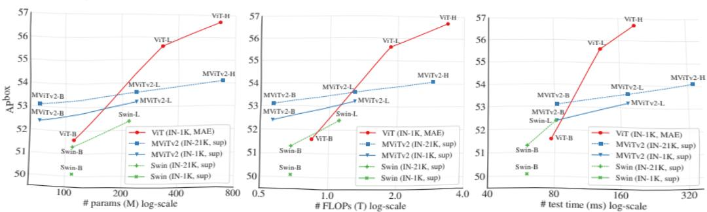
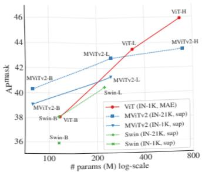
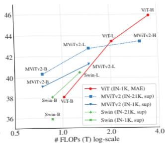
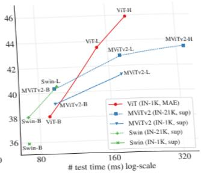
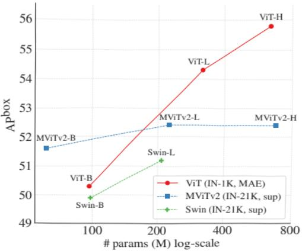

# Exploring Plain Vision Transformer Backbones for Object Detection

Yanghao Li Hanzi Mao Ross Girshick $ ^{\dagger} $  Kaiming He $ ^{\dagger} $ 

Facebook AI Research

## Abstract
 We explore the plain, non-hierarchical Vision Transformer (ViT) as a backbone network for object detection. This design enables the original ViT architecture to be fine-tuned for object detection without needing to redesign a hierarchical backbone for pre-training. With minimal adaptations for fine-tuning, our plain-backbone detector can achieve competitive results. Surprisingly, we observe: (i) it is sufficient to build a simple feature pyramid from a single-scale feature map (without the common FPN design) and (ii) it is sufficient to use window attention (without shifting) aided with very few cross-window propagation blocks. With plain ViT backbones pre-trained as Masked Autoencoders (MAE), our detector, named ViTDet, can compete with the previous leading methods that were all based on hierarchical backbones, reaching up to 61.3 AP $ ^{box} $  on the COCO dataset using only ImageNet-1K pre-training. We hope our study will draw attention to research on plain-backbone detectors. Code for ViTDet is available. $ ^{1} $ 

## 1 Introduction

Modern object detectors in general consist of a backbone feature extractor that is agnostic to the detection task and a set of necks and heads that incorporate detection-specific prior knowledge. Common components in the necks/heads may include Region-of-Interest (RoI) operations  $ [26,20,25] $ , Region Proposal Networks (RPN) or anchors  $ [48] $ , Feature Pyramid Networks (FPN)  $ [37] $ , etc. If the design of the task-specific necks/heads is decoupled from the design of the backbone, they may evolve in parallel. Empirically, object detection research has benefited from the largely independent exploration of general-purpose backbones  $ [30,49,50,27] $  and detection-specific modules. For a long while, these backbones have been multi-scale, hierarchical architectures due to the de facto design of convolutional networks (ConvNet)  $ [32] $ , which has heavily influenced the neck/head design for detecting objects at multiple scales (e.g., FPN).

Over the past year, Vision Transformers (ViT)  $ [14] $  have been established as a powerful backbone for visual recognition. Unlike typical ConvNets, the original ViT is a plain, non-hierarchical architecture that maintains a single-scale feature map throughout. Its “minimalist” pursuit is met by challenges when applied to object detection—e.g., How can we address multi-scale objects in a downstream task with a plain backbone from upstream pre-training? Is a plain ViT too

Figure 1: A typical hierarchical-backbone detector (left) vs. our plain-backbone detector (right). Traditional hierarchical backbones can be naturally adapted for multi-scale detection, e.g., using FPN. Instead, we explore building a simple pyramid from only the last, large-stride (16) feature map of a plain backbone.

inefficient to use with high-resolution detection images? One solution, which abandons this pursuit, is to re-introduce hierarchical designs into the backbone. This solution, e.g., Swin Transformers  $ [42] $  and related works  $ [55,17,34,29] $ , can inherit the ConvNet-based detector design and has shown successful results.

In this work, we pursue a different direction: we explore object detectors that use only plain, non-hierarchical backbones. $ ^{2} $  If this direction is successful, it will enable the use of original ViT backbones for object detection; this will decouple the pre-training design from the fine-tuning demands, maintaining the independence of upstream vs. downstream tasks, as has been the case for ConvNet-based research. This direction also in part follows the ViT philosophy of “fewer inductive biases”  $ [14] $  in the pursuit of universal features. As the non-local self-attention computation  $ [54] $  can learn translation-equivariant features  $ [14] $ , they may also learn scale-equivariant features from certain forms of supervised or self-supervised pre-training.

In our study, we do not aim to develop new components; instead, we make minimal adaptations that are sufficient to overcome the aforementioned challenges. In particular, our detector builds a simple feature pyramid from only the last feature map of a plain ViT backbone (Figure 1). This abandons the FPN design [37] and waives the requirement of a hierarchical backbone. To efficiently extract features from high-resolution images, our detector uses simple non-overlapping window attention (without “shifting”, unlike [42]). A small number of cross-window blocks (e.g., 4), which could be global attention [54] or convolutions, are used to propagate information. These adaptations are made only during fine-tuning and do not alter pre-training.

Our simple design turns out to achieve surprising results. We find that the FPN design is not necessary in the case of a plain ViT backbone and its benefit can be effectively gained by a simple pyramid built from a large-stride (16), single-scale map. We also find that window attention is sufficient as long as information is well propagated across windows in a small number of layers.

More surprisingly, under some circumstances, our plain-backbone detector, named ViTDet, can compete with the leading hierarchical-backbone detectors (e.g., Swin [42], MViT [17,34]). With Masked Autoencoder (MAE) [24] pre-

training, our plain-backbone detector can outperform the hierarchical counterparts that are pre-trained on ImageNet-1K/21K  $ [12] $  with supervision (Figure 3). The gains are more prominent for larger model sizes. The competitiveness of our detector is observed under different object detector frameworks, including Mask R-CNN  $ [25] $ , Cascade Mask R-CNN  $ [4] $ , and their enhancements. We report 61.3 AP $ ^{box} $  on the COCO dataset  $ [39] $  with a plain ViT-Huge backbone, using only ImageNet-1K pre-training with no labels. We also demonstrate competitive results on the long-tailed LVIS detection dataset  $ [23] $ . While these strong results may be in part due to the effectiveness of MAE pre-training, our study demonstrates that plain-backbone detectors can be promising, challenging the entrenched position of hierarchical backbones for object detection.

Beyond these results, our methodology maintains the philosophy of decoupling the detector-specific designs from the task-agnostic backbone. This philosophy is in contrast to the trend of redesigning Transformer backbones to support multi-scale hierarchies  $ [42,55,17,29] $ . In our case, the detection-specific prior knowledge is introduced only during fine-tuning, without needing to tailor the backbone design a priori in pre-training. This makes our detector compatible with ViT developments along various directions that are not necessarily limited by the hierarchical constraint, e.g., block designs  $ [52,53] $ , self-supervised learning  $ [2,24] $ , and scaling  $ [57] $ . We hope our study will inspire future research on plain-backbone object detection. $ ^{3} $ 

## 2 Related Work

Object detector backbones. Pioneered by the work of R-CNN [21], object detection and many other vision tasks adopt a pre-training + fine-tuning paradigm: a general-purpose, task-agnostic backbone is pre-trained with supervised or self-supervised training, whose structure is later modified and adapted to the downstream tasks. The dominant backbones in computer vision have been ConvNets [32] of various forms, e.g., [30,49,50,27].

Earlier neural network detectors, e.g., [26,20,48,47], were based on a single-scale feature map when originally presented. While they use ConvNet backbones that are by default hierarchical, in principle, they are applicable on any plain backbone. SSD [40] is among the first works that leverage the hierarchical nature of the ConvNet backbones (e.g., the last two stages of a VGG net [49]). FPN [37] pushes this direction further by using all stages of a hierarchical backbone, ap-proached by lateral and top-down connections. The FPN design is widely used in object detection methods. More recently, works including Trident Networks [33] and YOLOF [7] have revisited single-scale feature maps, but unlike our work they focus on a single-scale taken from a hierarchical backbone.

ViT [14] is a powerful alternative to standard ConvNets for image classification. The original ViT is a plain, non-hierarchical architecture. Various hierarchical Transformers have been presented, e.g., Swin [42], MViT [17,34], PVT [55],

and PiT [29]. These methods inherit some designs from ConvNets, including the hierarchical structure and the translation-equivariant priors (e.g., convolutions, pooling, sliding windows). As a result, it is relatively straightforward to replace a ConvNet with these backbones for object detection.

Plain-backbone detectors. The success of ViT has inspired people to push the frontier of plain backbones for object detection. Most recently, UViT  $ [9] $  is presented as a single-scale Transformer for object detection. UViT studies the network width, depth, and input resolution of plain ViT backbones under object detection metrics. A progressive window attention strategy is proposed to address the high-resolution inputs. Unlike UViT that modifies the architecture during pre-training, our study focuses on the original ViT architecture without a priori specification for detection. By maintaining the task-agnostic nature of the backbone, our approach supports a wide range of available ViT backbones as well as their improvements in the future. Our method decouples the backbone design from the detection task, which is a key motivation of pursuing plain backbones.

UViT uses single-scale feature maps for the detector heads, while our method builds a simple pyramid on the single-scale backbone. In the context of our study, it is an unnecessary constraint for the entire detector to be single-scale. Note the full UViT detector has several forms of multi-scale priors too (e.g., RPN  $ [48] $  and RoIAlign  $ [25] $ ) as it is based on Cascade Mask R-CNN  $ [4] $ . In our study, we focus on leveraging pre-trained plain backbones and we do not constrain the detector neck/head design.

Object detection methodologies. Object detection is a flourishing research area that has embraced methodologies of distinct properties—e.g., two-stage  $ [21,26,20,48] $  vs. one-stage  $ [47,40,38] $ , anchor-based  $ [48] $  vs. anchor-free  $ [31,15,51] $ , and region-based  $ [21,26,20,48] $  vs. query-based (DETR)  $ [5] $ . Research on different methodologies has been continuously advancing understandings of the object detection problem. Our study suggests that the topic of “plain vs. hierarchical” backbones is worth exploring and may bring in new insights.

## 3 Method

Our goal is to remove the hierarchical constraint on the backbone and to enable explorations of plain-backbone object detection. To this end, we aim for minimal modifications to adapt a plain backbone to the object detection task only during fine-tuning time. After these adaptations, in principle one can apply any detector heads, for which we opt to use Mask R-CNN  $ [25] $  and its extensions. We do not aim to develop new components; instead, we focus on what new insights can be drawn in our exploration.

Simple feature pyramid. FPN  $ [37] $  is a common solution of building an in-network pyramid for object detection. If the backbone is hierarchical, the motivation of FPN is to combine the higher-resolution features from earlier stages and the stronger features from later stages. This is realized in FPN by top-down and lateral connections  $ [37] $  (Figure 1 left).

(a) FPN, 4-stages

(b) FPN. last map

(c) simple feature pyramid

Figure 2: Building a feature pyramid on a plain backbone. (a) FPN-like: to mimic a hierarchical backbone, the plain backbone is artificially divided into multiple stages. (b) FPN-like, but using only the last feature map without stage division. (c) Our simple feature pyramid without FPN. In all three cases, strided convolutions/deconvolutions are used whenever the scale changes.

If the backbone is non-hierarchical, the foundation of the FPN motivation is lost, as all the feature maps in the backbone are of the same resolution. In our scenario, we simply use only the last feature map from the backbone, which should have the strongest features. On this map, we apply a set of convolutions or deconvolutions in parallel to produce multi-scale feature maps. Specifically, with the default ViT feature map of a scale of  $ \frac{1}{16} $  (stride = 16 [14]), we produce feature maps of scales  $ \{\frac{1}{32}, \frac{1}{16}, \frac{1}{8}, \frac{1}{4}\} $  using convolutions of strides  $ \{2, 1, \frac{1}{2}, \frac{1}{4}\} $ , where a fractional stride indicates a deconvolution. We refer to this as a “simple feature pyramid” (Figure 1 right).

The strategy of building multi-scale feature maps from a single map is related to that of SSD  $ [40] $ . However, our scenario involves upsampling from a deep, low-resolution feature map, unlike  $ [40] $ , which taps into shallower feature maps. In hierarchical backbones, upsampling is often aided by lateral connection  $ [37] $ ; in plain ViT backbones, we empirically find this is not necessary (Sec. 4) and simple deconvolutions are sufficient. We hypothesize that this is because ViT can rely on positional embedding  $ [54] $  for encoding locations and also because the high-dimensional ViT patch embeddings do not necessarily discard information. $ ^{4} $ 

We will compare with two FPN variants that are also built on a plain backbone (Figure 2). In the first variant, the backbone is artificially divided into multiple stages to mimic the stages of a hierarchical backbone, with lateral and top-down connections applied (Figure 2 (a)) [16]. The second variant is like the first one, but uses only the last map instead of the divided stages (Figure 2 (b)). We show that these FPN variants are not necessary (Sec. 4). $ ^{5} $ 

Backbone adaptation. Object detectors benefit from high-resolution input images, but computing global self-attention throughout the backbone is prohibitive in memory and is slow. In this study, we focus on the scenario where the pre-trained backbone performs global self-attention, which is then adapted to higher-resolution inputs during fine-tuning. This is in contrast to the recent

methods that modify the attention computation directly with backbone pre-training (e.g., [42,17]). Our scenario enables us to use the original ViT backbone for detection, without redesigning pre-training architectures.

We explore using window attention  $ [54] $  with a few cross-window blocks. During fine-tuning, given a high-resolution feature map, we divide it into regular non-overlapping windows. $ ^{6} $  Self-attention is computed within each window. This is referred to as “restricted” self-attention in the original Transformer  $ [54] $ .

Unlike Swin, we do not “shift”  $ [42] $  the windows across layers. To allow information propagation, we use a very few (by default, 4) blocks that can go across windows. We evenly split a pre-trained backbone into 4 subsets of blocks (e.g., 6 in each subset for the 24-block ViT-L). We apply a propagation strategy in the last block of each subset. We study these two strategies:

(i) Global propagation. We perform global self-attention in the last block of each subset. As the number of global blocks is small, the memory and computation cost is feasible. This is similar to the hybrid window attention in  $ [34] $  that was used jointly with FPN.

(ii) Convolutional propagation. As an alternative, we add an extra convolutional block after each subset. A convolutional block is a residual block  $ [27] $  that consists of one or more convolutions and an identity shortcut. The last layer in this block is initialized as zero, such that the initial status of the block is an identity  $ [22] $ . Initializing a block as identity allows us to insert it into any place in a pre-trained backbone without breaking the initial status of the backbone.

Our backbone adaptation is simple and makes detection fine-tuning compatible with global self-attention pre-training. As stated, it is not necessary to redesign the pre-training architectures.

Discussion. Object detectors contain components that can be task agnostic, such as the backbone, and other components that are task-specific, such as RoI heads. This model decomposition enables the task-agnostic components to be pre-trained using non-detection data (e.g., ImageNet), which may provide an advantage since detection training data is relatively scarce.

Under this perspective, it becomes reasonable to pursue a backbone that involves fewer inductive biases, since the backbone may be trained effectively using large-scale data and/or self-supervision. In contrast, the detection task-specific components have relatively little data available and may still benefit from additional inductive biases. While pursuing detection heads with fewer inductive biases is an active area of work, leading methods like DETR [5] are challenging to train and still benefit from detection-specific prior knowledge [60].

Driven by these observations, our work follows the spirit of the original plain ViT paper with respect to the detector's backbone. While the ViT paper's discussion [14] focused on reducing inductive biases on translation equivariance, in our case, it is about having fewer or even no inductive bias on scale equivariance in the backbone. We hypothesize that the way for a plain backbone to achieve

scale equivariance is to learn the prior knowledge from data, analogous to how it learns translation equivariance and locality without convolutions  $ [14] $ .

Our goal is to demonstrate the feasibility of this approach. Thus we choose to implement our method with standard detection specific components (i.e., Mask R-CNN and its extensions). Exploring even fewer inductive biases in the detection heads is an open and interesting direction for future work. We hope it can benefit from and build on our work here.

Implementation. We use the vanilla ViT-B, ViT-L, ViT-H  $ [14] $  as the pre-training backbones. We set the patch size as 16 and thus the feature map scale is 1/16, i.e., stride = 16. $ ^{7} $  Our detector heads follow Mask R-CNN  $ [25] $  or Cascade Mask R-CNN  $ [4] $ , with architectural details described in the appendix. The input image is  $ 1024 \times 1024 $ , augmented with large-scale jittering  $ [19] $  during training. Due to this heavy regularization, we fine-tune for up to 100 epochs in COCO. We use the AdamW optimizer  $ [43] $  and search for optimal hyper-parameters using a baseline version. More details are in the appendix.

## 4 Experiments

### 4.1 Ablation Study and Analysis

We perform ablation experiments on the COCO dataset  $ [39] $ . We train on the train2017 split and evaluate on the val2017 split. We report results on bounding-box object detection (AP $ ^{box} $ ) and instance segmentation (AP $ ^{mask} $ ).

By default, we use the simple feature pyramid and global propagation described in Sec. 3. We use 4 propagation blocks, evenly placed in the backbone. We initialize the backbone with MAE  $ [24] $  pre-trained on IN-1K without labels. We ablate these defaults and discuss our main observations as follows.

A simple feature pyramid is sufficient. In Table 1 we compare the feature pyramid building strategies illustrated in Figure 2.

We study a baseline with no feature pyramid: both the RPN and RoI heads are applied on the backbone's final, single-scale  $ \left(\frac{1}{16}\right) $  feature map. This case is similar to the original Faster R-CNN [48] before FPN was proposed. All feature pyramid variants (Table 1 a-c) are substantially better than this baseline, increasing AP by up to 3.4 points. We note that using a single-scale feature map does not mean the detector is single-scale: the RPN head has multi-scale anchors and the RoI heads operate on regions of multiple scales. Even so, feature pyramids are beneficial. This observation is consistent with the observation in the FPN paper [37] on hierarchical backbones.

However, the FPN design is not needed and our simple feature pyramid is sufficient for a plain ViT backbone to enjoy the benefit of a pyramid. To ablate this design, we mimic the FPN architecture (i.e., the top-down and lateral

<table border=1 style='margin: auto; width: max-content;'><tr><td rowspan="2">pyramid design</td><td colspan="2">ViT-B</td><td colspan="2">ViT-L</td></tr><tr><td style='text-align: center;'>AP $ ^{\text{box}} $</td><td style='text-align: center;'>AP $ ^{\text{mask}} $</td><td style='text-align: center;'>AP $ ^{\text{box}} $</td><td style='text-align: center;'>AP $ ^{\text{mask}} $</td></tr><tr><td style='text-align: center;'>no feature pyramid</td><td style='text-align: center;'>47.8</td><td style='text-align: center;'>42.5</td><td style='text-align: center;'>51.2</td><td style='text-align: center;'>45.4</td></tr><tr><td style='text-align: center;'>(a) FPN, 4-stage</td><td style='text-align: center;'>50.3 (+2.5)</td><td style='text-align: center;'>44.9 (+2.4)</td><td style='text-align: center;'>54.4 (+3.2)</td><td style='text-align: center;'>48.4 (+3.0)</td></tr><tr><td style='text-align: center;'>(b) FPN, last-map</td><td style='text-align: center;'>50.9 (+3.1)</td><td style='text-align: center;'>45.3 (+2.8)</td><td style='text-align: center;'>54.6 (+3.4)</td><td style='text-align: center;'>48.5 (+3.1)</td></tr><tr><td style='text-align: center;'>(c) simple feature pyramid</td><td style='text-align: center;'>51.2 (+3.4)</td><td style='text-align: center;'>45.5 (+3.0)</td><td style='text-align: center;'>54.6 (+3.4)</td><td style='text-align: center;'>48.6 (+3.2)</td></tr></table>

Table 1: Ablation on feature pyramid design with plain ViT backbones, using Mask R-CNN evaluated on COCO. The backbone is ViT-B (left) and ViT-L (right). The entries (a-c) correspond to Figure 2 (a-c), compared to a baseline without any pyramid. Both FPN and our simple pyramid are substantially better than the baseline, while our simple pyramid is sufficient.

connections) as in Figure 2 (a, b). Table 1 (a, b) shows that while both FPN variants achieve strong gains over the baseline with no pyramid (as has been widely observed with the original FPN on hierarchical backbones), they are no better than our simple feature pyramid. The original FPN [37] was motivated by combining lower-resolution, stronger feature maps with higher-resolution, weaker feature maps. This foundation is lost when the backbone is plain and has no high-resolution maps, which can explain why our simple pyramid is sufficient.

Our ablation reveals that the set of pyramidal feature maps, rather than the top-down/lateral connections, is the key to effective multi-scale detection. To see this, we study an even more aggressive case of the simple pyramid: we generate only the finest scale  $ \left(\frac{1}{4}\right) $  feature map by deconvolution and then from this finest map we subsample other scales in parallel by strided average pooling. There are no unshared, per-scale parameters in this design. This aggressively-simple pyramid is nearly as good: it has 54.5 AP (ViT-L), 3.3 higher than the no pyramid baseline. This shows the importance of pyramidal feature maps. For any variant of these feature pyramids, the anchors (in RPN) and regions (in RoI heads) are mapped to the corresponding level in the pyramid based on their scales, as in [37]. We hypothesize that this explicit scale-equivariant mapping, rather than the top-down/lateral connection, is the main reason why a feature pyramid can greatly benefit multi-scale object detection.

Window attention is sufficient when aided by a few propagation blocks. Table 2 ablates our backbone adaptation approach. In short, on top of a baseline that has purely window attention and none of the cross-window propagation blocks (Table 2, "none"), various ways of propagation can show decent gains. $ ^{8} $ 

In Table 2a, we compare our global and convolutional propagation strategies vs. the no propagation baseline. They have a gain of 1.7 and 1.9 over the baseline. We also compare with the "shifted window" (Swin  $ [42] $ ) strategy, in which the window grid is shifted by a half-window size for every other block. The shifted

<table border=1 style='margin: auto; width: max-content;'><tr><td style='text-align: center;'>prop. strategy</td><td style='text-align: center;'>AP $ ^{\text{box}} $</td><td style='text-align: center;'>AP $ ^{\text{mask}} $</td></tr><tr><td style='text-align: center;'>none</td><td style='text-align: center;'>52.9</td><td style='text-align: center;'>47.2</td></tr><tr><td style='text-align: center;'>4 global blocks</td><td style='text-align: center;'>54.6 (+1.7)</td><td style='text-align: center;'>48.6 (+1.4)</td></tr><tr><td style='text-align: center;'>4 conv blocks</td><td style='text-align: center;'>54.8 (+1.9)</td><td style='text-align: center;'>48.8 (+1.6)</td></tr><tr><td style='text-align: center;'>shifted win.</td><td style='text-align: center;'>54.0 (+1.1)</td><td style='text-align: center;'>47.9 (+0.7)</td></tr></table>

<table border=1 style='margin: auto; width: max-content;'><tr><td style='text-align: center;'>prop. conv</td><td style='text-align: center;'>AP $ ^{\text{box}} $</td><td style='text-align: center;'>AP $ ^{\text{mask}} $</td></tr><tr><td style='text-align: center;'>none</td><td style='text-align: center;'>52.9</td><td style='text-align: center;'>47.2</td></tr><tr><td style='text-align: center;'>naïve</td><td style='text-align: center;'>54.3 (+1.4)</td><td style='text-align: center;'>48.3 (+1.1)</td></tr><tr><td style='text-align: center;'>basic</td><td style='text-align: center;'>54.8 (+1.9)</td><td style='text-align: center;'>48.8 (+1.6)</td></tr><tr><td style='text-align: center;'>bottleneck</td><td style='text-align: center;'>54.6 (+1.7)</td><td style='text-align: center;'>48.6 (+1.4)</td></tr></table>

(a) Window attention with various cross-window propagation strategies.

(b) Convolutional propagation with different residual block types (4 blocks).

<table border=1 style='margin: auto; width: max-content;'><tr><td style='text-align: center;'>prop. locations</td><td style='text-align: center;'>AP $ ^{\text{box}} $</td><td style='text-align: center;'>AP $ ^{\text{mask}} $</td></tr><tr><td style='text-align: center;'>none</td><td style='text-align: center;'>52.9</td><td style='text-align: center;'>47.2</td></tr><tr><td style='text-align: center;'>first 4 blocks</td><td style='text-align: center;'>52.9 (+0.0)</td><td style='text-align: center;'>47.1 (-0.1)</td></tr><tr><td style='text-align: center;'>last 4 blocks</td><td style='text-align: center;'>54.3 (+1.4)</td><td style='text-align: center;'>48.3 (+1.1)</td></tr><tr><td style='text-align: center;'>evenly 4 blocks</td><td style='text-align: center;'>54.6 (+1.7)</td><td style='text-align: center;'>48.6 (+1.4)</td></tr></table>

<table border=1 style='margin: auto; width: max-content;'><tr><td style='text-align: center;'>prop. blks</td><td style='text-align: center;'>AP $ ^{\text{box}} $</td><td style='text-align: center;'>AP $ ^{\text{mask}} $</td></tr><tr><td style='text-align: center;'>none</td><td style='text-align: center;'>52.9</td><td style='text-align: center;'>47.2</td></tr><tr><td style='text-align: center;'>2</td><td style='text-align: center;'>54.4 (+1.5)</td><td style='text-align: center;'>48.5 (+1.3)</td></tr><tr><td style='text-align: center;'>4</td><td style='text-align: center;'>54.6 (+1.7)</td><td style='text-align: center;'>48.6 (+1.4)</td></tr><tr><td style='text-align: center;'>24 $ ^{\dagger} $</td><td style='text-align: center;'>55.1 (+2.2)</td><td style='text-align: center;'>48.9 (+1.7)</td></tr></table>

(c) Locations of cross-window global propagation blocks.

(d) Number of global propagation blocks.  $ ^{\dagger} $ : Memory optimization required.

Table 2: Ablation on backbone adaptation strategies using a plain ViT backbone and Mask R-CNN evaluated on COCO. All blocks perform window attention, unless modified by the propagation strategy. In sum, compared to the baseline that uses only window attention  $ (52.9\ AP^{\text{box}}) $  most configurations work effectively as long as information can be well propagated across windows. Here the backbone is ViT-L; the observations on ViT-B are similar (see the appendix).

<table border=1 style='margin: auto; width: max-content;'><tr><td style='text-align: center;'>prop. strategy</td><td style='text-align: center;'>AP $ ^{\text{box}} $</td><td style='text-align: center;'># params</td><td style='text-align: center;'>train mem</td><td style='text-align: center;'>test time</td></tr><tr><td style='text-align: center;'>none</td><td style='text-align: center;'>52.9</td><td style='text-align: center;'>1.00\times (331M)</td><td style='text-align: center;'>1.00\times (14.6G)</td><td style='text-align: center;'>1.00\times (88ms)</td></tr><tr><td style='text-align: center;'>4 conv (bottleneck)</td><td style='text-align: center;'>54.6 (+1.7)</td><td style='text-align: center;'>1.04\times</td><td style='text-align: center;'>1.05\times</td><td style='text-align: center;'>1.04\times</td></tr><tr><td style='text-align: center;'>4 global</td><td style='text-align: center;'>54.6 (+1.7)</td><td style='text-align: center;'>1.00\times</td><td style='text-align: center;'>1.39\times</td><td style='text-align: center;'>1.16\times</td></tr><tr><td style='text-align: center;'>24 global</td><td style='text-align: center;'>55.1 (+2.2)</td><td style='text-align: center;'>1.00\times</td><td style='text-align: center;'>3.34\times $ ^{\dagger} $</td><td style='text-align: center;'>1.86\times</td></tr></table>

Table 3: Practical performance of backbone adaptation strategies. The backbone is ViT-L. The training memory (per GPU) is benchmarked with a batch size of 1. The testing time (per image) is benchmarked on an A100 GPU.  $ \dagger $ : This  $ 3.34\times $  memory (49G) is estimated as if the same training implementation could be used, which is not practical and requires special memory optimization that all together slows down training by  $ 2.2\times $  vs. the baseline.

window variant has a 1.1 gain over the baseline, but is worse than ours. Note that here we focus only on the "shifted window" aspect of Swin  $ [42] $ : the backbone is still a plain ViT, adapted to shifted window attention only during fine-tuning; it is not the Swin architecture, which we will compare to later.

Table 2b compares different types of residual blocks for convolutional propagation. We study the basic (two  $ 3 \times 3 $ ) [27], bottleneck  $ (1 \times 1 \rightarrow 3 \times 3 \rightarrow 1 \times 1) $  [27], and a naïve block that has one  $ 3 \times 3 $  convolution. They all improve over the baseline, while the specific block design makes only marginal differences. Interestingly, even though convolution is a local operation if its receptive field covers

<table border=1 style='margin: auto; width: max-content;'><tr><td rowspan="2">pre-train</td><td colspan="2">ViT-B</td><td colspan="2">ViT-L</td></tr><tr><td style='text-align: center;'>AP $ _{\text{box}} $</td><td style='text-align: center;'>AP $ _{\text{mask}} $</td><td style='text-align: center;'>AP $ _{\text{box}} $</td><td style='text-align: center;'>AP $ _{\text{mask}} $</td></tr><tr><td style='text-align: center;'>none (random init.)</td><td style='text-align: center;'>48.1</td><td style='text-align: center;'>42.6</td><td style='text-align: center;'>50.0</td><td style='text-align: center;'>44.2</td></tr><tr><td style='text-align: center;'>IN-1K, supervised</td><td style='text-align: center;'>47.6 (-0.5)</td><td style='text-align: center;'>42.4 (-0.2)</td><td style='text-align: center;'>49.6 (-0.4)</td><td style='text-align: center;'>43.8 (-0.4)</td></tr><tr><td style='text-align: center;'>IN-21K, supervised</td><td style='text-align: center;'>47.8 (-0.3)</td><td style='text-align: center;'>42.6 (+0.0)</td><td style='text-align: center;'>50.6 (+0.6)</td><td style='text-align: center;'>44.8 (+0.6)</td></tr><tr><td style='text-align: center;'>IN-1K, MAE</td><td style='text-align: center;'>51.2 (+3.1)</td><td style='text-align: center;'>45.5 (+2.9)</td><td style='text-align: center;'>54.6 (+4.6)</td><td style='text-align: center;'>48.6 (+4.4)</td></tr></table>

Table 4: Ablation on pre-training strategies with plain ViT backbones using Mask R-CNN evaluated on COCO.

two adjacent windows, it is sufficient in principle to connect all pixels of the two windows. This connectivity is thanks to the self-attention in both windows in the succeeding blocks. This may explain why it can perform as well as global propagation.

In Table 2c we study where cross-window propagation should be located in the backbone. By default 4 global propagation blocks are placed evenly. We compare with placing them in the first or last 4 blocks instead. Interestingly, performing propagation in the last 4 blocks is nearly as good as even placement. This is in line with the observation in  $ [14] $  that ViT has longer attention distance in later blocks and is more localized in earlier ones. In contrast, performing propagation only in the first 4 blocks shows no gain: in this case, there is no propagation across windows in the backbone after these 4 blocks. This again demonstrates that propagation across windows is helpful.

Table 2d compares the number of global propagation blocks to use. Even using just 2 blocks achieves good accuracy and clearly outperforms the baseline. For comprehensiveness, we also report a variant where all 24 blocks in ViT-L use global attention. This has a marginal gain of 0.5 points over our 4-block default, while its training requires special memory optimization (we use memory checkpointing  $ [8] $ ). This requirement makes scaling to larger models (like ViT-H) impractical. Our solution of window attention plus a few propagation blocks offers a practical, high-performing tradeoff.

We benchmark this tradeoff in Table 3. Using 4 propagation blocks gives a good trade-off. Convolutional propagation is the most practical, increasing memory and time by merely  $ \leq5\% $ , at a small cost of 4% more parameters. Global propagation with 4 blocks is also feasible and does not increase the model size. Global self-attention in all 24 blocks is not practical.

In sum, Table 2 shows that various forms of propagation are helpful, while we can keep using window attention in most or all blocks. Importantly, all these architecture adaptations are performed only during fine-tuning time; they do not require a redesign of the pre-training architecture.

Masked Autoencoders provide strong pre-trained backbones. Table 4 compares backbone pre-training strategies. Supervised pre-training on IN-1K is slightly worse than no pre-training, similar to the observation in  $ [19] $ . Supervised pre-training on IN-21K is marginally better for ViT-L.

In contrast, MAE  $ [24] $  pre-training on IN-1K (without labels) shows massive gains, increasing AP $ _{box} $  by 3.1 for ViT-B and 4.6 for ViT-L. We hypothesize that

<table border=1 style='margin: auto; width: max-content;'><tr><td rowspan="2">backbone</td><td rowspan="2">pre-train</td><td colspan="2">Mask R-CNN</td><td colspan="2">Cascade Mask R-CNN</td></tr><tr><td style='text-align: center;'>$ AP^{box} $</td><td style='text-align: center;'>$ AP^{mask} $</td><td style='text-align: center;'>$ AP^{box} $</td><td style='text-align: center;'>$ AP^{mask} $</td></tr><tr><td colspan="6">hierarchical-backbone detectors:</td></tr><tr><td style='text-align: center;'>Swin-B</td><td style='text-align: center;'>21K, sup</td><td style='text-align: center;'>51.4</td><td style='text-align: center;'>45.4</td><td style='text-align: center;'>54.0</td><td style='text-align: center;'>46.5</td></tr><tr><td style='text-align: center;'>Swin-L</td><td style='text-align: center;'>21K, sup</td><td style='text-align: center;'>52.4</td><td style='text-align: center;'>46.2</td><td style='text-align: center;'>54.8</td><td style='text-align: center;'>47.3</td></tr><tr><td style='text-align: center;'>MViTv2-B</td><td style='text-align: center;'>21K, sup</td><td style='text-align: center;'>53.1</td><td style='text-align: center;'>47.4</td><td style='text-align: center;'>55.6</td><td style='text-align: center;'>48.1</td></tr><tr><td style='text-align: center;'>MViTv2-L</td><td style='text-align: center;'>21K, sup</td><td style='text-align: center;'>53.6</td><td style='text-align: center;'>47.5</td><td style='text-align: center;'>55.7</td><td style='text-align: center;'>48.3</td></tr><tr><td style='text-align: center;'>MViTv2-H</td><td style='text-align: center;'>21K, sup</td><td style='text-align: center;'>54.1</td><td style='text-align: center;'>47.7</td><td style='text-align: center;'>55.8</td><td style='text-align: center;'>48.3</td></tr><tr><td colspan="6">our plain-backbone detectors:</td></tr><tr><td style='text-align: center;'>ViT-B</td><td style='text-align: center;'>1K, MAE</td><td style='text-align: center;'>51.6</td><td style='text-align: center;'>45.9</td><td style='text-align: center;'>54.0</td><td style='text-align: center;'>46.7</td></tr><tr><td style='text-align: center;'>ViT-L</td><td style='text-align: center;'>1K, MAE</td><td style='text-align: center;'>55.6</td><td style='text-align: center;'>49.2</td><td style='text-align: center;'>57.6</td><td style='text-align: center;'>49.8</td></tr><tr><td style='text-align: center;'>ViT-H</td><td style='text-align: center;'>1K, MAE</td><td style='text-align: center;'>56.7</td><td style='text-align: center;'>50.1</td><td style='text-align: center;'>58.7</td><td style='text-align: center;'>50.9</td></tr></table>

Table 5: Comparisons of plain vs. hierarchical backbones using Mask R-CNN  $ [25] $  and Cascade Mask R-CNN  $ [4] $  on COCO. Tradeoffs are plotted in Figure 3. All entries are implemented and run by us to align low-level details.

the vanilla ViT  $ [14] $ , with fewer inductive biases, may require higher-capacity to learn translation and scale equivariant features, while higher-capacity models are prone to heavier overfitting. MAE pre-training can help to relieve this problem. We discuss more about MAE in context next.

### 4.2 Comparisons with Hierarchical Backbones

Modern detection systems involve many implementation details and subtleties. To focus on comparing backbones under as fair conditions as possible, we incorporate the Swin  $ [42] $  and MViTv2  $ [34] $  backbones into our implementation.

Settings. We use the same implementation of Mask R-CNN  $ [25] $  and Cascade Mask R-CNN  $ [4] $  for all ViT, Swin, and MViTv2 backbones. We use FPN for the hierarchical backbones of Swin/MViTv2. We search for optimal hyperparameters separately for each backbone (see the appendix). Our Swin results are better than their counterparts in the original paper; $ ^{9} $  our MViTv2 results are better than or on par with those reported in  $ [34] $ .

Following the original papers  $ [42,34] $ , Swin and MViTv2 both use relative position biases  $ [46] $ . For a fairer comparison, here we also adopt relative position biases in our ViT backbones as per  $ [34] $ , but only during fine-tuning, not affecting pre-training. This addition improves AP by  $ \sim1 $  point. Note that our ablations in Sec. 4.1 are without relative position biases.

Results and analysis. Table 5 shows the comparisons. Figure 3 plots the trade-offs. The comparisons here involve two factors: the backbone and the pre-training strategy. Our plain-backbone detector, combined with MAE pre-training, presents better scaling behavior. When the models are large, our method outperforms the

Figure 3: Tradeoffs of accuracy vs. model sizes (left), FLOPs (middle), and wall-clock testing time (right). All entries are implemented and run by us to align low-level details. Swin  $ [42] $  and MViTv2  $ [34] $  are pre-trained on IN-1K/21K with supervision. The ViT models are pre-trained using MAE  $ [24] $  on IN-1K. Here the detector head is Mask R-CNN; similar trends are observed for Cascade Mask R-CNN and one-stage detector RetinaNet (Figure 5 in the appendix). Detailed numbers are in the appendix (Table 9).

hierarchical counterparts of Swin/MViTv2, including those using IN-21K supervised pre-training. Our result with ViT-H is 2.6 better than that with MViTv2-H. Moreover, the plain ViT has a better wall-clock performance (Figure 3 right, see ViT-H vs. MViTv2-H), as the simpler blocks are more hardware-friendly.

We are also curious about the influence of MAE on hierarchical backbones. This is largely beyond the scope of this paper, as it involves finding good training recipes for hierarchical backbones with MAE. To provide some insight, we implement a naïve extension of MAE with the MViTv2 backbone (see the appendix). We observe that MViTv2-L with this MAE pre-training on IN-1K is 1.3 better than that with IN-21K supervised pre-training (54.9 vs. 53.6 AP $ _{box} $ ). As a comparison, this gap is 4 points for our plain-backbone detector (Table 4). This shows that the plain ViT backbone may benefit more from MAE pre-training than the hierarchical backbone, suggesting that the lack of inductive biases on scales could be compensated by the self-supervised training of MAE. While it is an interesting future topic on improving hierarchical backbones with MAE pre-training, our plain-backbone detector enables us to use the readily available ViT backbones from MAE to achieve strong results.

We also note that hierarchical backbones in general involve enhanced self-attention block designs. Examples include the shifted window attention in Swin  $ [42] $  and pooling attention in MViT v1/v2  $ [17,34] $ . These block designs, if applied to plain backbones, may also improve accuracy and parameter-efficiency. While this may put our competitors at an advantage, our method is still competitive without these enhancements.

### 4.3 Comparisons with Previous Systems

Next we provide system-level comparisons with the leading results reported in previous papers. We refer to our system as ViTDet, i.e., ViT Detector, aim

<table border=1 style='margin: auto; width: max-content;'><tr><td rowspan="2">method</td><td rowspan="2">framework</td><td rowspan="2">pre-train</td><td colspan="2">single-scale test</td><td colspan="2">multi-scale test</td></tr><tr><td style='text-align: center;'>AP $ _{\text{box}} $</td><td style='text-align: center;'>AP $ _{\text{mask}} $</td><td style='text-align: center;'>AP $ _{\text{box}} $</td><td style='text-align: center;'>AP $ _{\text{mask}} $</td></tr><tr><td colspan="7">hierarchical-backbone detectors:</td></tr><tr><td style='text-align: center;'>Swin-L [42]</td><td style='text-align: center;'>HTC++</td><td style='text-align: center;'>21K, sup</td><td style='text-align: center;'>57.1</td><td style='text-align: center;'>49.5</td><td style='text-align: center;'>58.0</td><td style='text-align: center;'>50.4</td></tr><tr><td style='text-align: center;'>MViTv2-L [34]</td><td style='text-align: center;'>Cascade</td><td style='text-align: center;'>21K, sup</td><td style='text-align: center;'>56.9</td><td style='text-align: center;'>48.6</td><td style='text-align: center;'>58.7</td><td style='text-align: center;'>50.5</td></tr><tr><td style='text-align: center;'>MViTv2-H [34]</td><td style='text-align: center;'>Cascade</td><td style='text-align: center;'>21K, sup</td><td style='text-align: center;'>57.1</td><td style='text-align: center;'>48.8</td><td style='text-align: center;'>58.4</td><td style='text-align: center;'>50.1</td></tr><tr><td style='text-align: center;'>CBNetV2 [36] $ ^{\dagger} $</td><td style='text-align: center;'>HTC</td><td style='text-align: center;'>21K, sup</td><td style='text-align: center;'>59.1</td><td style='text-align: center;'>51.0</td><td style='text-align: center;'>59.6</td><td style='text-align: center;'>51.8</td></tr><tr><td style='text-align: center;'>SwinV2-L [41]</td><td style='text-align: center;'>HTC++</td><td style='text-align: center;'>21K, sup</td><td style='text-align: center;'>58.9</td><td style='text-align: center;'>51.2</td><td style='text-align: center;'>60.2</td><td style='text-align: center;'>52.1</td></tr><tr><td colspan="7">plain-backbone detectors:</td></tr><tr><td style='text-align: center;'>UViT-S [9]</td><td style='text-align: center;'>Cascade</td><td style='text-align: center;'>1K, sup</td><td style='text-align: center;'>51.9</td><td style='text-align: center;'>44.5</td><td style='text-align: center;'>-</td><td style='text-align: center;'>-</td></tr><tr><td style='text-align: center;'>UViT-B [9]</td><td style='text-align: center;'>Cascade</td><td style='text-align: center;'>1K, sup</td><td style='text-align: center;'>52.5</td><td style='text-align: center;'>44.8</td><td style='text-align: center;'>-</td><td style='text-align: center;'>-</td></tr><tr><td style='text-align: center;'>ViTDet, ViT-B</td><td style='text-align: center;'>Cascade</td><td style='text-align: center;'>1K, MAE</td><td style='text-align: center;'>56.0</td><td style='text-align: center;'>48.0</td><td style='text-align: center;'>57.3</td><td style='text-align: center;'>49.4</td></tr><tr><td style='text-align: center;'>ViTDet, ViT-L</td><td style='text-align: center;'>Cascade</td><td style='text-align: center;'>1K, MAE</td><td style='text-align: center;'>59.6</td><td style='text-align: center;'>51.1</td><td style='text-align: center;'>60.4</td><td style='text-align: center;'>52.2</td></tr><tr><td style='text-align: center;'>ViTDet, ViT-H</td><td style='text-align: center;'>Cascade</td><td style='text-align: center;'>1K, MAE</td><td style='text-align: center;'>60.4</td><td style='text-align: center;'>52.0</td><td style='text-align: center;'>61.3</td><td style='text-align: center;'>53.1</td></tr></table>

Table 6: System-level comparisons with the leading results on COCO reported by the original papers. The detection framework is Cascade Mask R-CNN  $ [4] $  (denoted as "Cascade"), Hybrid Task Cascade (HTC)  $ [6] $ , or its extension (HTC++  $ [42] $ ). Here we compare results that use ImageNet data (1K or 21K); better results are reported in  $ [41,11] $  using extra data.  $ \dagger $ :  $ [36] $  combines two Swin-L backbones.

ing at the usage of a ViT backbone for detection. Since these comparisons are system-level, the methods use a variety of different techniques. While we make efforts to balance the comparisons (as noted below), making a perfectly controlled comparison is infeasible in general; our goal, instead, is to situate our method in the context of current leading methods.

Comparisons on COCO. Table 6 reports the system-level comparisons on COCO. For a fairer comparison, here we make two changes following our competitors: we adopt soft-nms  $ [3] $  as is used by all competitors  $ [42,34,36,41] $  in this table and increase the input size (from 1024 to 1280) following  $ [36,41] $ . We note that we do not use these improvements in previous ablations. As in the previous subsection (Sec. 4.3), we use relative position biases here.

The leading systems thus far are all based on hierarchical backbones (Table 6). For the first time, we show that a plain-backbone detector can achieve highly accurate results on COCO and can compete with the leading systems.

We also compare with UViT  $ [9] $  which is a recent plain-backbone detection method. As discussed in Sec. 2, UViT and our work have different focuses. UViT aims at designing a new plain backbone that is good for detection, while our goal here is to support general-purpose ViT backbones including the original ones in  $ [14] $ . Despite the different focuses, both UViT and our work suggest that plain-backbone detection is a promising direction with strong potential.

Comparisons on LVIS. We further report system-level comparisons on the LVIS dataset  $ [23] $ . LVIS contains  $ \sim $ 2M high-quality instance segmentation annotations for 1203 classes that exhibit a natural, long-tailed object distribution.

<table border=1 style='margin: auto; width: max-content;'><tr><td style='text-align: center;'>method</td><td style='text-align: center;'>pre-train</td><td style='text-align: center;'>AP $ _{\text{mask}} $</td><td style='text-align: center;'>AP $ _{\text{mask rate}} $</td><td style='text-align: center;'>AP $ _{\text{box}} $</td></tr><tr><td colspan="5">hierarchical-backbone detectors:</td></tr><tr><td style='text-align: center;'>Copy-Paste [19], Eff-B7 FPN</td><td style='text-align: center;'>none (random init)</td><td style='text-align: center;'>36.0</td><td style='text-align: center;'>29.7</td><td style='text-align: center;'>39.2</td></tr><tr><td style='text-align: center;'>Detic [58], Swin-B</td><td style='text-align: center;'>21K, sup; CLIP</td><td style='text-align: center;'>41.7</td><td style='text-align: center;'>41.7</td><td style='text-align: center;'>-</td></tr><tr><td style='text-align: center;'>competition winner 2021 [18] baseline,  $ \dagger $</td><td style='text-align: center;'>21K, sup</td><td style='text-align: center;'>43.1</td><td style='text-align: center;'>34.3</td><td style='text-align: center;'>-</td></tr><tr><td style='text-align: center;'>competition winner 2021 [18] full,  $ \dagger $</td><td style='text-align: center;'>21K, sup</td><td style='text-align: center;'>49.2</td><td style='text-align: center;'>45.4</td><td style='text-align: center;'>-</td></tr><tr><td colspan="5">plain-backbone detectors:</td></tr><tr><td style='text-align: center;'>ViTDet, ViT-L</td><td style='text-align: center;'>1K, MAE</td><td style='text-align: center;'>46.0</td><td style='text-align: center;'>34.3</td><td style='text-align: center;'>51.2</td></tr><tr><td style='text-align: center;'>ViTDet, ViT-H</td><td style='text-align: center;'>1K, MAE</td><td style='text-align: center;'>48.1</td><td style='text-align: center;'>36.9</td><td style='text-align: center;'>53.4</td></tr></table>

Table 7: System-level comparisons with the leading results on LVIS (v1 val) reported by the original papers. All results are without test-time augmentation. Detic  $ [58] $  uses pre-trained CLIP  $ [44] $  text embeddings.  $ \dagger $ : these entries use CBNetV2  $ [36] $  that combines two Swin-L backbones.

Unlike COCO, the class distribution is heavily imbalanced and many classes have very few  $ (e.g., <10) $  training examples.

We follow the same model and training details as used for the COCO system-level comparison plus two common LVIS practices: we use the federated loss from  $ [59] $  and sample images with repeat factor sampling  $ [23] $ . We fine-tune for 100 epochs on the v1 train split.

Table 7 shows the results on the v1 val split. Our plain-backbone detector achieves competitive performance vs. previous leading results that all use hierarchical backbones. Ours is 5.0 points higher than the 2021 competition winner's "strong baseline"  $ [18] $  (48.1 vs. 43.1 AP $ ^{mask} $ ), which uses HTC with CBNetV2  $ [36] $  that combines two Swin-L backbones. A special issue in LVIS is on the long-tailed distribution, which is beyond the scope of our study. Techniques dedicated to this issue, e.g., using CLIP  $ [44] $  text embeddings or other advancements from  $ [18] $ , can largely increase AP on the rare classes (AP $ _{rare}^{mask} $ ) and thus improve overall AP. These are orthogonal to our method and could be complementary. Nevertheless, our results on LVIS again suggest that plain-backbone detectors can compete with hierarchical ones.

## 5 Conclusion

Our exploration has demonstrated that plain-backbone detection is a promising research direction. This methodology largely maintains the independence of the general-purpose backbones and the downstream task-specific designs—which had been the case for ConvNet-based research but not for Transformer-based research. We hope decoupling pre-training from fine-tuning is a methodology that will generally benefit the community. For example, in natural language processing (NLP), general-purpose pre-training (GPT  $ [45] $ , BERT  $ [13] $ ) has greatly advanced the field and has been supporting various downstream tasks. In this study, our plain-backbone detector has benefited from the readily available pretrained models from MAE  $ [24] $ . We hope this methodology will also help bring the fields of computer vision and NLP closer.

## A Appendix

### A.1 Additional Ablation Results

Table 8 is the ViT-B counterpart of Table 2 on backbone adaptation. The observations are similar to that of ViT-L: comparing with the baseline using no propagation (“none”), various propagation strategies show good gains.

Table 9 presents Table 5 with additional details about FLOPs, parameters, and inference time, plotted in Figure 3.

Table 10 is the ablation on pre-training strategies for LVIS. Similar to Table 4, MAE pre-training has large gains over supervised pre-training.

Figure 4 is the LVIS counterpart of Figure 3. The trends are similar to those in COCO, while the gain of IN-21K supervised pre-training is larger because it significantly improves rare category detection in LVIS.

Figure 5 is the RetinaNet [38] counterpart of Figure 3, showing the trade-off between accuracy and model size. Here, we evaluate ViTDet with a one-stage RetinaNet [38] detector head and compare it to using Swin and MViTv2 as hierarchical backbones, all without hyper-parameter tuning. Compared to using Mask R-CNN and Cascade R-CNN (Table 5 and Figure 3), we observe similar trends with RetinaNet. In particular, our plain-backbone detector presents better scaling behavior (e.g., ViT-H gains  $ +3.4~AP^{box} $  over MViTv2-H). These results suggest that the proposed training recipe transfers well to different detectors and that our proposed plain backbone adaptations are general and can likely work with even more detection architectures.

### A.2 Implementation Details

Architectures. We build a simple feature pyramid of scales  $ \left\{\frac{1}{32}, \frac{1}{16}, \frac{1}{8}, \frac{1}{4}\right\} $  (see Sec. 3). The  $ \frac{1}{32} $  scale is built by stride-2  $ 2 \times 2 $  max pooling (average pooling or convolution works similarly). The  $ \frac{1}{16} $  scale simply uses the ViT's final feature map. Scale  $ \frac{1}{8} $  (or  $ \frac{1}{4} $ ) is built by one (or two)  $ 2 \times 2 $  deconvolution layer(s) with stride=2. In the  $ \frac{1}{4} $  scale case, the first deconvolution is followed by LayerNorm (LN) [1] and GeLU [28]. Then for each pyramid level, we apply a  $ 1 \times 1 $  convolution with LN to reduce dimension to 256 and then a  $ 3 \times 3 $  convolution also with LN, similar to the per-level processing of FPN [37].

We study three detection frameworks: Mask R-CNN  $ [25] $ , Cascade Mask R-CNN  $ [4] $  and RetinaNet  $ [38] $ . For Mask R-CNN and Cascade Mask R-CNN, we incorporate some common best practices developed since they  $ [25,4] $  were presented years ago. We use 2 hidden convolution layers for the RPN and 4 hidden convolution layers for the RoI heads as per  $ [56] $ . These hidden convolution layers are followed by LN. For all three detection frameworks, we use the same detection implementation for both plain and hierarchical backbones.

We use a patch size of 16 for all ViT backbones. As ViT-H in  $ [14] $  by default has a patch size of 14, after pre-training we interpolate the patch embedding filters from  $ 14 \times 14 \times 3 $  to  $ 16 \times 16 \times 3 $ .

<table border=1 style='margin: auto; width: max-content;'><tr><td style='text-align: center;'>prop. strategy</td><td style='text-align: center;'>AP $ ^{\text{box}} $</td><td style='text-align: center;'>AP $ ^{\text{mask}} $</td></tr><tr><td style='text-align: center;'>none</td><td style='text-align: center;'>48.9</td><td style='text-align: center;'>43.9</td></tr><tr><td style='text-align: center;'>4 global blocks</td><td style='text-align: center;'>51.2 (+2.3)</td><td style='text-align: center;'>45.5 (+1.6)</td></tr><tr><td style='text-align: center;'>4 conv blocks</td><td style='text-align: center;'>51.0 (+2.1)</td><td style='text-align: center;'>45.3 (+1.4)</td></tr><tr><td style='text-align: center;'>shifted win.</td><td style='text-align: center;'>50.1 (+1.2)</td><td style='text-align: center;'>44.8 (+0.9)</td></tr></table>

<table border=1 style='margin: auto; width: max-content;'><tr><td style='text-align: center;'>prop. conv</td><td style='text-align: center;'>AP $ ^{\text{box}} $</td><td style='text-align: center;'>AP $ ^{\text{mask}} $</td></tr><tr><td style='text-align: center;'>none</td><td style='text-align: center;'>48.9</td><td style='text-align: center;'>43.9</td></tr><tr><td style='text-align: center;'>naïve</td><td style='text-align: center;'>50.6 (+1.7)</td><td style='text-align: center;'>45.2 (+1.3)</td></tr><tr><td style='text-align: center;'>basic</td><td style='text-align: center;'>50.7 (+1.8)</td><td style='text-align: center;'>45.2 (+1.3)</td></tr><tr><td style='text-align: center;'>bottleneck</td><td style='text-align: center;'>51.0 (+2.1)</td><td style='text-align: center;'>45.3 (+1.4)</td></tr></table>

(a) Window attention with various cross-window propagation strategies.

(b) Convolutional propagation with different residual block types (4 blocks).

<table border=1 style='margin: auto; width: max-content;'><tr><td style='text-align: center;'>prop. locations</td><td style='text-align: center;'>AP $ ^{\text{box}} $</td><td style='text-align: center;'>AP $ ^{\text{mask}} $</td></tr><tr><td style='text-align: center;'>none</td><td style='text-align: center;'>48.9</td><td style='text-align: center;'>43.9</td></tr><tr><td style='text-align: center;'>first 4 blocks</td><td style='text-align: center;'>49.1 (+0.2)</td><td style='text-align: center;'>44.1 (+0.2)</td></tr><tr><td style='text-align: center;'>last 4 blocks</td><td style='text-align: center;'>50.9 (+2.0)</td><td style='text-align: center;'>45.4 (+1.5)</td></tr><tr><td style='text-align: center;'>evenly 4 blocks</td><td style='text-align: center;'>51.2 (+2.3)</td><td style='text-align: center;'>45.5 (+1.6)</td></tr></table>

<table border=1 style='margin: auto; width: max-content;'><tr><td style='text-align: center;'>prop. blks</td><td style='text-align: center;'>AP $ ^{\text{box}} $</td><td style='text-align: center;'>AP $ ^{\text{mask}} $</td></tr><tr><td style='text-align: center;'>none</td><td style='text-align: center;'>48.9</td><td style='text-align: center;'>43.9</td></tr><tr><td style='text-align: center;'>2</td><td style='text-align: center;'>50.7 (+1.8)</td><td style='text-align: center;'>45.2 (+1.3)</td></tr><tr><td style='text-align: center;'>4</td><td style='text-align: center;'>51.2 (+2.3)</td><td style='text-align: center;'>45.5 (+1.6)</td></tr><tr><td style='text-align: center;'>12</td><td style='text-align: center;'>50.4 (+1.5)</td><td style='text-align: center;'>45.1 (+1.2)</td></tr></table>

(c) Locations of cross-window global propagation blocks.

(d) Number of global propagation blocks.

Table 8: The ViT-B counterpart of Table 2 (backbone adaptation).

Hyper-parameters for COCO. Our default training recipe is as follows (unless noted in context for ablation). The input size is  $ 1024 \times 1024 $ , augmented during training by large-scale jitter  $ [19] $  with a scale range of  $ [0.1, 2.0] $ . We use AdamW  $ [43] $  ( $ \beta_{1}, \beta_{2}=0.9, 0.999 $ ) with step-wise learning rate decay. We use linear learning rate warm-up  $ [22] $  for 250 iterations. The batch size is 64, distributed across 64 GPUs (1 image per GPU).

We search for the learning rate  $ (lr) $ , weight decay  $ (wd) $ , drop path rate  $ (dp) $ , and epochs, for each model size (B, L, H) and for each model type (ViT, Swin, MViTv2). The hyper-parameters used are in Table 11. We also use a layer-wise lr decay [10][2] of 0.7/0.8/0.9 for ViT-B/L/H with MAE pre-training, which has a small gain of up to 0.3 AP; we have not seen this gain for hierarchical backbones or ViT with supervised pre-training.

Hyper-parameters for LVIS. Our LVIS experiments in Table 7 follow the COCO settings in Table 5. For LVIS, we set  $ lr = 2e^{-4}/1e^{-4} $  (ViT-L/H), wd = 0.1, and dp = 0.4. We fine-tune for 100 epochs. We use a test score threshold of 0.02 (smaller values did not help) and repeat factor sampling  $ (t = 0.001) $  [23]. We output  $ \leq 300 $  detections per image following [23] (vs. COCO's default 100).

MAE for hierarchical backbones. We implement a naïve extension of MAE pre-training  $ [24] $  for the hierarchical backbone ablation (Sec. 4.2). MAE enjoys the efficiency benefit from plain ViT by skipping the encoder mask token  $ [24] $ . Extending this strategy to hierarchical backbones is beyond the scope of this paper. Instead, we adopt a straightforward solution in which we do not skip the encoder mask token (similar to  $ [13] $ ), at the cost of slower training. We use normalized pixels as the MAE reconstruction target  $ [24] $  and set the decoder depth as 2.

<table border=1 style='margin: auto; width: max-content;'><tr><td rowspan="2">backbone</td><td rowspan="2">pre-train</td><td colspan="5">Mask R-CNN</td><td colspan="5">Cascade Mask R-CNN</td></tr><tr><td style='text-align: center;'>AP $ _{\text{box}} $</td><td style='text-align: center;'>AP $ _{\text{mask}} $</td><td style='text-align: center;'>FLOPs</td><td style='text-align: center;'>params</td><td style='text-align: center;'>time</td><td style='text-align: center;'>AP $ _{\text{box}} $</td><td style='text-align: center;'>AP $ _{\text{mask}} $</td><td style='text-align: center;'>FLOPs</td><td style='text-align: center;'>params</td><td style='text-align: center;'>time</td></tr><tr><td colspan="12">hierarchical-backbone detectors:</td></tr><tr><td style='text-align: center;'>Swin-B</td><td style='text-align: center;'>1K, sup</td><td style='text-align: center;'>50.1</td><td style='text-align: center;'>44.5</td><td style='text-align: center;'>0.7T</td><td style='text-align: center;'>109M</td><td style='text-align: center;'>60ms</td><td style='text-align: center;'>52.7</td><td style='text-align: center;'>45.5</td><td style='text-align: center;'>0.9T</td><td style='text-align: center;'>139M</td><td style='text-align: center;'>76ms</td></tr><tr><td style='text-align: center;'>Swin-B</td><td style='text-align: center;'>21K, sup</td><td style='text-align: center;'>51.4</td><td style='text-align: center;'>45.4</td><td style='text-align: center;'>0.7T</td><td style='text-align: center;'>109M</td><td style='text-align: center;'>60ms</td><td style='text-align: center;'>54.0</td><td style='text-align: center;'>46.5</td><td style='text-align: center;'>0.9T</td><td style='text-align: center;'>139M</td><td style='text-align: center;'>76ms</td></tr><tr><td style='text-align: center;'>Swin-L</td><td style='text-align: center;'>21K, sup</td><td style='text-align: center;'>52.4</td><td style='text-align: center;'>46.2</td><td style='text-align: center;'>1.1T</td><td style='text-align: center;'>218M</td><td style='text-align: center;'>81ms</td><td style='text-align: center;'>54.8</td><td style='text-align: center;'>47.3</td><td style='text-align: center;'>1.4T</td><td style='text-align: center;'>248M</td><td style='text-align: center;'>96ms</td></tr><tr><td style='text-align: center;'>MViTv2-B</td><td style='text-align: center;'>1K, sup</td><td style='text-align: center;'>52.4</td><td style='text-align: center;'>46.7</td><td style='text-align: center;'>0.6T</td><td style='text-align: center;'>73M</td><td style='text-align: center;'>82ms</td><td style='text-align: center;'>54.7</td><td style='text-align: center;'>47.5</td><td style='text-align: center;'>0.8T</td><td style='text-align: center;'>103M</td><td style='text-align: center;'>97ms</td></tr><tr><td style='text-align: center;'>MViTv2-L</td><td style='text-align: center;'>1K, sup</td><td style='text-align: center;'>53.2</td><td style='text-align: center;'>47.1</td><td style='text-align: center;'>1.3T</td><td style='text-align: center;'>239M</td><td style='text-align: center;'>173ms</td><td style='text-align: center;'>55.2</td><td style='text-align: center;'>47.7</td><td style='text-align: center;'>1.6T</td><td style='text-align: center;'>270M</td><td style='text-align: center;'>189ms</td></tr><tr><td style='text-align: center;'>MViTv2-B</td><td style='text-align: center;'>21K, sup</td><td style='text-align: center;'>53.1</td><td style='text-align: center;'>47.4</td><td style='text-align: center;'>0.6T</td><td style='text-align: center;'>73M</td><td style='text-align: center;'>82ms</td><td style='text-align: center;'>55.6</td><td style='text-align: center;'>48.1</td><td style='text-align: center;'>0.8T</td><td style='text-align: center;'>103M</td><td style='text-align: center;'>97ms</td></tr><tr><td style='text-align: center;'>MViTv2-L</td><td style='text-align: center;'>21K, sup</td><td style='text-align: center;'>53.6</td><td style='text-align: center;'>47.5</td><td style='text-align: center;'>1.3T</td><td style='text-align: center;'>239M</td><td style='text-align: center;'>173ms</td><td style='text-align: center;'>55.7</td><td style='text-align: center;'>48.3</td><td style='text-align: center;'>1.6T</td><td style='text-align: center;'>270M</td><td style='text-align: center;'>189ms</td></tr><tr><td style='text-align: center;'>MViTv2-H</td><td style='text-align: center;'>21K, sup</td><td style='text-align: center;'>54.1</td><td style='text-align: center;'>47.7</td><td style='text-align: center;'>2.9T</td><td style='text-align: center;'>688M</td><td style='text-align: center;'>338ms</td><td style='text-align: center;'>55.8</td><td style='text-align: center;'>48.3</td><td style='text-align: center;'>3.2T</td><td style='text-align: center;'>718M</td><td style='text-align: center;'>353ms</td></tr><tr><td colspan="12">our plain-backbone detectors:</td></tr><tr><td style='text-align: center;'>ViT-B</td><td style='text-align: center;'>1K, MAE</td><td style='text-align: center;'>51.6</td><td style='text-align: center;'>45.9</td><td style='text-align: center;'>0.8T</td><td style='text-align: center;'>111M</td><td style='text-align: center;'>77ms</td><td style='text-align: center;'>54.0</td><td style='text-align: center;'>46.7</td><td style='text-align: center;'>1.1T</td><td style='text-align: center;'>141M</td><td style='text-align: center;'>92ms</td></tr><tr><td style='text-align: center;'>ViT-L</td><td style='text-align: center;'>1K, MAE</td><td style='text-align: center;'>55.6</td><td style='text-align: center;'>49.2</td><td style='text-align: center;'>1.9T</td><td style='text-align: center;'>331M</td><td style='text-align: center;'>132ms</td><td style='text-align: center;'>57.6</td><td style='text-align: center;'>49.8</td><td style='text-align: center;'>2.1T</td><td style='text-align: center;'>361M</td><td style='text-align: center;'>149ms</td></tr><tr><td style='text-align: center;'>ViT-H</td><td style='text-align: center;'>1K, MAE</td><td style='text-align: center;'>56.7</td><td style='text-align: center;'>50.1</td><td style='text-align: center;'>3.4T</td><td style='text-align: center;'>662M</td><td style='text-align: center;'>189ms</td><td style='text-align: center;'>58.7</td><td style='text-align: center;'>50.9</td><td style='text-align: center;'>3.6T</td><td style='text-align: center;'>692M</td><td style='text-align: center;'>203ms</td></tr></table>

Table 9: Detailed measurements of Table 5 and Figure 3.

<table border=1 style='margin: auto; width: max-content;'><tr><td style='text-align: center;'>pre-train</td><td style='text-align: center;'>AP $ _{\text{box}} $</td><td style='text-align: center;'>ViT-B AP $ _{\text{mask}} $</td><td style='text-align: center;'>AP $ _{\text{mask}} $  rare</td><td style='text-align: center;'>AP $ _{\text{box}} $</td><td style='text-align: center;'>ViT-L AP $ _{\text{mask}} $</td><td style='text-align: center;'>AP $ _{\text{mask}} $  rare</td></tr><tr><td style='text-align: center;'>IN-1K, supervised</td><td style='text-align: center;'>37.2</td><td style='text-align: center;'>34.9</td><td style='text-align: center;'>26.4</td><td style='text-align: center;'>38.3</td><td style='text-align: center;'>36.0</td><td style='text-align: center;'>26.7</td></tr><tr><td style='text-align: center;'>IN-21K, supervised</td><td style='text-align: center;'>38.7</td><td style='text-align: center;'>36.3</td><td style='text-align: center;'>28.8</td><td style='text-align: center;'>42.1</td><td style='text-align: center;'>39.5</td><td style='text-align: center;'>34.3</td></tr><tr><td style='text-align: center;'>IN-1K, MAE</td><td style='text-align: center;'>40.1</td><td style='text-align: center;'>38.1</td><td style='text-align: center;'>29.1</td><td style='text-align: center;'>46.1</td><td style='text-align: center;'>43.5</td><td style='text-align: center;'>35.3</td></tr></table>

Table 10: The LVIS counterpart of Table 4 (COCO pre-training ablation). The observations are similar to Table 4: MAE pre-training has large gains over supervised pre-training. Here we also report rare category results. We observe that both IN-21K supervised and IN-1K MAE pre-training significantly improve  $ AP_{rare}^{mask} $ , especially for ViT-L. (Mask R-CNN, 1024 resolution, no soft-nms.)

Figure 4: The LVIS counterpart of Figure 3. All entries are implemented and run by us to align low-level details. Here the detector head is Mask R-CNN (input resolution 1024; no soft-nms). The trends are similar to those in Figure 3, while IN-21K supervised pre-training has larger gains.

<table border=1 style='margin: auto; width: max-content;'><tr><td style='text-align: center;'>backbone</td><td style='text-align: center;'>pre-train</td><td style='text-align: center;'>lr</td><td style='text-align: center;'>wd</td><td style='text-align: center;'>dp</td><td style='text-align: center;'>epochs</td></tr><tr><td style='text-align: center;'>ViT-B/L</td><td style='text-align: center;'>none</td><td style='text-align: center;'>$ 1.6 \times 10^{-4} $</td><td style='text-align: center;'>0.2</td><td style='text-align: center;'>0.1/0.4</td><td style='text-align: center;'>300/200</td></tr><tr><td style='text-align: center;'>ViT-B/L</td><td style='text-align: center;'>supervised</td><td style='text-align: center;'>$ 8 \times 10^{-5} $</td><td style='text-align: center;'>0.1</td><td style='text-align: center;'>0.1/0.4</td><td style='text-align: center;'>50</td></tr><tr><td style='text-align: center;'>ViT-B/L/H</td><td style='text-align: center;'>MAE</td><td style='text-align: center;'>$ 1 \times 10^{-4} $</td><td style='text-align: center;'>0.1</td><td style='text-align: center;'>0.1/0.4/0.5</td><td style='text-align: center;'>100/100/75</td></tr><tr><td style='text-align: center;'>Swin-B/L</td><td style='text-align: center;'>supervised</td><td style='text-align: center;'>$ 1 \times 10^{-4}/8 \times 10^{-5} $</td><td style='text-align: center;'>0.05</td><td style='text-align: center;'>0.3</td><td style='text-align: center;'>50</td></tr><tr><td style='text-align: center;'>MViTv2-B/L/H</td><td style='text-align: center;'>supervised</td><td style='text-align: center;'>$ 8 \times 10^{-5} $</td><td style='text-align: center;'>0.1</td><td style='text-align: center;'>0.4/0.5/0.6</td><td style='text-align: center;'>100/50/36</td></tr></table>

Table 11: Hyper-parameters for COCO. Multiple values in a cell are for different model sizes. The epochs are chosen such that training longer starts to overfit.

Figure 5: The RetinaNet [38] counterpart of Figure 3, showing the trade-off between accuracy and model size. We use the same Mask R-CNN training recipe (input resolution 1024; no soft-nms) and hyper-parameters for RetinaNet. The trends are similar to those in Figure 3.

Acknowledgement. We would like to acknowledge Xinlei Chen, Saining Xie, Piotr Dollár, and Christoph Feichtenhofer for discussions and support.

## References

1. Jimmy Lei Ba, Jamie Ryan Kiros, and Geoffrey E Hinton. Layer normalization. arXiv:1607.06450, 2016.

2. Hangbo Bao, Li Dong, and Furu Wei. BEiT: BERT pre-training of image Transformers. arXiv:2106.08254, 2021.

3. Navaneeth Bodla, Bharat Singh, Rama Chellappa, and Larry S Davis. Soft-NMS – improving object detection with one line of code. In ICCV, 2017.

4. Zhaowei Cai and Nuno Vasconcelos. Cascade R-CNN: high quality object detection and instance segmentation. TPAMI, 2019.

5. Nicolas Carion, Francisco Massa, Gabriel Synnaeve, Nicolas Usunier, Alexander Kirillov, and Sergey Zagoruyko. End-to-end object detection with Transformers. In ECCV, 2020.

6. Kai Chen, Jiangmiao Pang, Jiaqi Wang, Yu Xiong, Xiaoxiao Li, Shuyang Sun, Wansen Feng, Ziwei Liu, Jianping Shi, Wanli Ouyang, Chen Change Loy, and Dahua Lin. Hybrid task cascade for instance segmentation. In CVPR, 2019.

7. Qiang Chen, Yingming Wang, Tong Yang, Xiangyu Zhang, Jian Cheng, and Jian Sun. You only look one-level feature. In CVPR, 2021.

8. Tianqi Chen, Bing Xu, Chiyuan Zhang, and Carlos Guestrin. Training deep nets with sublinear memory cost. arXiv:1604.06174, 2016.

9. Wuyang Chen, Xianzhi Du, Fan Yang, Lucas Beyer, Xiaohua Zhai, Tsung-Yi Lin, Huizhong Chen, Jing Li, Xiaodan Song, Zhangyang Wang, and Denny Zhou. A simple single-scale Vision Transformer for object localization and instance segmentation. arXiv:2112.09747, 2021.

10. Kevin Clark, Minh-Thang Luong, Quoc V Le, and Christopher D Manning. ELECTRA: Pre-training text encoders as discriminators rather than generators. In ICLR, 2020.

11. Xiyang Dai, Yinpeng Chen, Bin Xiao, Dongdong Chen, Mengchen Liu, Lu Yuan, and Lei Zhang. Dynamic head: Unifying object detection heads with attentions. In CVPR, 2021.

12. Jia Deng, Wei Dong, Richard Socher, Li-Jia Li, Kai Li, and Li Fei-Fei. ImageNet: A large-scale hierarchical image database. In CVPR, 2009.

13. Jacob Devlin, Ming-Wei Chang, Kenton Lee, and Kristina Toutanova. BERT: Pre-training of deep bidirectional Transformers for language understanding. In NAACL, 2019.

14. Alexey Dosovitskiy, Lucas Beyer, Alexander Kolesnikov, Dirk Weissenborn, Xiaohua Zhai, Thomas Unterthiner, Mostafa Dehghani, Matthias Minderer, Georg Heigold, Sylvain Gelly, Jakob Uszkoreit, and Neil Houlsby. An image is worth  $ 16 \times 16 $  words: Transformers for image recognition at scale. In ICLR, 2021.

15. Kaiwen Duan, Song Bai, Lingxi Xie, Honggang Qi, Qingming Huang, and Qi Tian. CenterNet: Keypoint triplets for object detection. In ICCV, 2019.

16. Alaaeldin El-Nouby, Hugo Touvron, Mathilde Caron, Piotr Bojanowski, Matthijs Douze, Armand Joulin, Ivan Laptev, Natalia Neverova, Gabriel Synnaeve, Jakob Verbeek, and Herve Jegou. XCiT: Cross-covariance image Transformers. In NeurIPS, 2021.

17. Haoqi Fan, Bo Xiong, Karttikeya Mangalam, Yanghao Li, Zhicheng Yan, Jitendra Malik, and Christoph Feichtenhofer. Multiscale Vision Transformers. In ICCV, 2021.

18. WeiFu Fu, CongChong Nie, Ting Sun, Jun Liu, TianLiang Zhang, and Yong Liu. LVIS challenge track technical report 1st place solution: Distribution balanced and boundary refinement for large vocabulary instance segmentation. arXiv:2111.02668, 2021.

19. Golnaz Ghiasi, Yin Cui, Aravind Srinivas, Rui Qian, Tsung-Yi Lin, Ekin D Cubuk, Quoc V Le, and Barret Zoph. Simple copy-paste is a strong data augmentation method for instance segmentation. In CVPR, 2021.

20. Ross Girshick. Fast R-CNN. In ICCV, 2015.

21. Ross Girshick, Jeff Donahue, Trevor Darrell, and Jitendra Malik. Rich feature hierarchies for accurate object detection and semantic segmentation. In CVPR, 2014.

22. Priya Goyal, Piotr Dollár, Ross Girshick, Pieter Noordhuis, Lukasz Wesolowski, Aapo Kyrola, Andrew Tulloch, Yangqing Jia, and Kaiming He. Accurate, large minibatch SGD: Training ImageNet in 1 hour. arXiv:1706.02677, 2017.

23. Agrim Gupta, Piotr Dollar, and Ross Girshick. LVIS: A dataset for large vocabulary instance segmentation. In CVPR, 2019.

24. Kaiming He, Xinlei Chen, Saining Xie, Yanghao Li, Piotr Dollár, and Ross Girshick. Masked autoencoders are scalable vision learners. arXiv:2111.06377, 2021.

25. Kaiming He, Georgia Gkioxari, Piotr Dollár, and Ross Girshick. Mask R-CNN. In ICCV, 2017.

26. Kaiming He, Xiangyu Zhang, Shaoqing Ren, and Jian Sun. Spatial pyramid pooling in deep convolutional networks for visual recognition. In ECCV, 2014.

27. Kaiming He, Xiangyu Zhang, Shaoqing Ren, and Jian Sun. Deep residual learning for image recognition. In CVPR, 2016.

28. Dan Hendrycks and Kevin Gimpel. Gaussian error linear units (GeLUs). arXiv:1606.08415, 2016.

29. Byeongho Heo, Sangdoo Yun, Dongyoon Han, Sanghyuk Chun, Junsuk Choe, and Seong Joon Oh. Rethinking spatial dimensions of Vision Transformers. In ICCV, 2021.

30. Alex Krizhevsky, Ilya Sutskever, and Geoff Hinton. Imagenet classification with deep convolutional neural networks. In NeurIPS, 2012.

31. Hei Law and Jia Deng. CornerNet: Detecting objects as paired keypoints. In ECCV, 2018.

32. Yann LeCun, Bernhard Boser, John S Denker, Donnie Henderson, Richard E Howard, Wayne Hubbard, and Lawrence D Jackel. Backpropagation applied to handwritten zip code recognition. Neural computation, 1989.

33. Yanghao Li, Yuntao Chen, Naiyan Wang, and Zhaoxiang Zhang. Scale-aware tri-dent networks for object detection. In ICCV, 2019.

34. Yanghao Li, Chao-Yuan Wu, Haoqi Fan, Karttikeya Mangalam, Bo Xiong, Jitendra Malik, and Christoph Feichtenhofer. MViTv2: Improved multiscale Vision Transformers for classification and detection. arXiv:2112.01526, 2021.

35. Yanghao Li, Saining Xie, Xinlei Chen, Piotr Dollar, Kaiming He, and Ross Girshick. Benchmarking detection transfer learning with Vision Transformers. arXiv:2111.11429, 2021.

36. Tingting Liang, Xiaojie Chu, Yudong Liu, Yongtao Wang, Zhi Tang, Wei Chu, Jingdong Chen, and Haibin Ling. CBNetV2: A composite backbone network architecture for object detection. arXiv:2107.00420, 2021.

37. Tsung-Yi Lin, Piotr Dollár, Ross Girshick, Kaiming He, Bharath Hariharan, and Serge Belongie. Feature pyramid networks for object detection. In CVPR, 2017.

38. Tsung-Yi Lin, Priya Goyal, Ross Girshick, Kaiming He, and Piotr Dollár. Focal loss for dense object detection. In ICCV, 2017.

39. Tsung-Yi Lin, Michael Maire, Serge Belongie, James Hays, Pietro Perona, Deva Ramanan, Piotr Dollár, and C Lawrence Zitnick. Microsoft COCO: Common objects in context. In ECCV, 2014.

40. Wei Liu, Dragomir Anguelov, Dumitru Erhan, Christian Szegedy, Scott Reed, Cheng-Yang Fu, and Alexander C Berg. SSD: Single shot multibox detector. In ECCV, 2016.

41. Ze Liu, Han Hu, Yutong Lin, Zhuliang Yao, Zhenda Xie, Yixuan Wei, Jia Ning, Yue Cao, Zheng Zhang, Li Dong, Furu Wei, and Baining Guo. Swin Transformer V2: Scaling up capacity and resolution. arXiv:2111.09883, 2021.

42. Ze Liu, Yutong Lin, Yue Cao, Han Hu, Yixuan Wei, Zheng Zhang, Stephen Lin, and Baining Guo. Swin Transformer: Hierarchical ision Transformer using shifted windows. In ICCV, 2021.

43. Ilya Loshchilov and Frank Hutter. Decoupled weight decay regularization. In ICLR, 2019.

44. Alec Radford, Jong Wook Kim, Chris Hallacy, Aditya Ramesh, Gabriel Goh, Sandhini Agarwal, Girish Sastry, Amanda Askell, Pamela Mishkin, Jack Clark, Gretchen Krueger, and Ilya Sutskever. Learning transferable visual models from natural language supervision. 2021.

45. Alec Radford, Karthik Narasimhan, Tim Salimans, and Ilya Sutskever. Improving language understanding by generative pre-training. 2018.

46. Colin Raffel, Noam Shazeer, Adam Roberts, Katherine Lee, Sharan Narang, Michael Matena, Yanqi Zhou, Wei Li, and Peter J. Liu. Exploring the limits of transfer learning with a unified text-to-text transformer. JMLR, 2020.

47. Joseph Redmon, Santosh Divvala, Ross Girshick, and Ali Farhadi. You only look once: Unified, real-time object detection. In CVPR, 2016.

48. Shaoqing Ren, Kaiming He, Ross Girshick, and Jian Sun. Faster R-CNN: Towards real-time object detection with region proposal networks. In NeurIPS, 2015.

49. Karen Simonyan and Andrew Zisserman. Very deep convolutional networks for large-scale image recognition. In ICLR, 2015.

50. Christian Szegedy, Wei Liu, Yangqing Jia, Pierre Sermanet, Scott Reed, Dragomir Anguelov, Dumitru Erhan, Vincent Vanhoucke, and Andrew Rabinovich. Going deeper with convolutions. In CVPR, 2015.

51. Zhi Tian, Chunhua Shen, Hao Chen, and Tong He. FCOS: Fully convolutional one-stage object detection. In ICCV, 2019.

52. Ilya Tolstikhin, Neil Houlsby, Alexander Kolesnikov, Lucas Beyer, Xiaohua Zhai, Thomas Unterthiner, Jessica Yung, Andreas Steiner, Daniel Keysers, Jakob Uszkoreit, Mario Lucic, and Alexey Dosovitskiy. MLP-mixer: An all-MLP architecture for vision. NeurIPS, 2021.

53. Hugo Touvron, Piotr Bojanowski, Mathilde Caron, Matthieu Cord, Alaaeldin El-Nouby, Edouard Grave, Armand Joulin, Gabriel Synnaeve, Jakob Verbeek, and Hervé Jégou. ResMLP: Feedforward networks for image classification with data-efficient training. arXiv:2105.03404, 2021.

54. Ashish Vaswani, Noam Shazeer, Niki Parmar, Jakob Uszkoreit, Llion Jones, Aidan N Gomez, Lukasz Kaiser, and Illia Polosukhin. Attention is all you need. In NeurIPS, 2017.

55. Wenhai Wang, Enze Xie, Xiang Li, Deng-Ping Fan, Kaitao Song, Ding Liang, Tong Lu, Ping Luo, and Ling Shao. Pyramid Vision Transformer: A versatile backbone for dense prediction without convolutions. In ICCV, 2021.

56. Yuxin Wu and Kaiming He. Group normalization. In ECCV, 2018.

57. Xiaohua Zhai, Alexander Kolesnikov, Neil Houlsby, and Lucas Beyer. Scaling Vision Transformers. arXiv:2106.04560, 2021.

58. Xingyi Zhou, Rohit Girdhar, Armand Joulin, Phillip Krähenbühl, and Ishan Misra. Detecting twenty-thousand classes using image-level supervision. arXiv:2201.02605, 2022.

59. Xingyi Zhou, Vladlen Koltun, and Phillip Krähenbühl. Probabilistic two-stage detection. arXiv preprint arXiv:2103.07461, 2021.

60. Xizhou Zhu, Weijie Su, Lewei Lu, Bin Li, Xiaogang Wang, and Jifeng Dai. Deformable DETR: Deformable Transformers for end-to-end object detection. In ICLR, 2020.